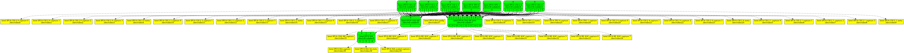

# How to build a Mainline Linux kernel

## Requirements

* ~30GB free storage space

## 1. Install required packages

To install the required packages and build dependencies, run:

```bash
sudo apt update && \
    sudo apt build-dep -y linux linux-image-unsigned-$(uname -r) && \
    sudo apt install -y fakeroot llvm libncurses-dev dwarves
```

Some other packages that might be usefull:

```bash
sudo apt install -y git gawk flex bison openssl libssl-dev dkms autoconf \
    libelf-dev libudev-dev libpci-dev libiberty-dev
```

## 2. Clone the ipu4-next repo

```bash
git clone -b mainline-6.1.158 \
    https://github.com/ruslanbay/ipu4-next

cd ipu4-next
```

## 3. Obtain the source code

### 3.1. Get local copy of kernel source

```bash
git clone -b v6.1.158 --single-branch --depth=1 \
    https://git.kernel.org/pub/scm/linux/kernel/git/stable/linux.git linux
```

### 3.2. Apply patches

```bash
cd linux

git am ../patches/*.patch
```

## 4. Prepare the kernel source

Turn off the generation of debugging symbols (.debug files). This significantly reduces the size of the compiled kernel image:

```bash
./scripts/config --disable DEBUG_INFO
```

Execute this to avoid common build errors related to missing cryptographic keys:

```bash
./scripts/config --set-str CONFIG_SYSTEM_TRUSTED_KEYS ""
./scripts/config --set-str CONFIG_SYSTEM_REVOCATION_KEYS ""
```

## 5. Modify kernel configuration

To enable or disable any features using the kernel configuration, run `make editconfig` or `make oldconfig`.

This will invoke the menuconfig interface for you to edit specific configuration files related to the Ubuntu kernel package. You will need to explicitly respond with Y or N when making any config changes to avoid getting errors later in the build process.

Choose the following:
```
Device Drivers > Multimedia support > Media drivers > Media PCI Adapters
- Intel IPU driver
  - intel ipu generation type (Compile for IPU4 driver)
    - (X) Compile for IPU4P driver
  - intel ipu hardware platform type (Compile for SOC)
    - (X) Compile for SOC


Device Drivers > Multimedia support > Media drivers > V4L platform devices
 - <M> Enable built in platform data for ipu4p

Device Drivers > Multimedia support > Media ancillary drivers > Camera sensor devices
 - <M> CRL Module sensor support

Device Drivers > Staging drivers > Media staging drivers > Enable support to Intel Atom ISP camera drivers
 - < > Omnivision ov5693 sensor support
```

## 6. Build the kernel

You are now ready to build the kernel.

```bash
make clean && \
    make -j12 bindeb-pkg LOCALVERSION=-ipu4p
```

**Note**: *Run `make clean` to clean the build environment each time before you recompile the kernel **after making any changes** to the kernel source or configuration.*

If the build is successful, several .deb binary package files will be produced in the directory one level above the kernel source working directory.

## 7. Install the new kernel

Install all the debian packages generated from the previous step (on your build system or a different target system with the same architecture) with dpkg -i and reboot:

```bash
cd ..

sudo dpkg -i linux-headers-6.1.158-ipu4p_6.1.158-ipu4p-2_amd64.deb \
    linux-image-6.1.158-ipu4p_6.1.158-ipu4p-2_amd64.deb

sudo reboot
```

## 8. Test the new kernel

Run any necessary testing to confirm that your changes and customizations have taken effect. You should also confirm that the newly installed kernel version matches the value in the <kernel_source_working_directory>/debian.master/changelog file by running:

```bash
uname -r
```

## 9. Build and install the `libcamerahal` package

Follow the instructions provided in the [libcamerahal README](libcamerahal/README.md).

## 10. Build and install the `icamerasrc` package

Follow the instructions provided in the [icamerasrc README](icamerasrc/README.md).

## 11. Known issues and workarounds

### Moduledata and library version mismatch

```
[    4.074538] intel-ipu4 intel-ipu: Moduledata and library version mismatch (20191030 != 20181222)
[    4.074652] intel-ipu4 intel-ipu: Invalid moduledata
[    4.074713] intel-ipu4 intel-ipu: Failed to validate cpd
[    4.074909] intel-ipu4: probe of intel-ipu failed with error -22
```

Workaround:

```bash
echo "options intel_ipu4p fw_version_check=0" | sudo tee /etc/modprobe.d/ipu4.conf

sudo systemctl reboot
```

## 12. Verification



<details>
  <summary>
    <strong>
      journalctl -b | grep -Ei "ipu4|ov5693|INT33BE|ov8865|INT347A"
    </strong>
  </summary>

```
kernel: Intel platform data PCI quirk for IPU4P
kernel: intel-ipu4 intel-ipu: enabling device (0000 -> 0002)
kernel: intel-ipu4 intel-ipu: Device 0x8a19 (rev: 0x3)
kernel: intel-ipu4 intel-ipu: physical base address 0x6000000000
kernel: intel-ipu4 intel-ipu: mapped as: 0x000000000ec9c5e0
kernel: intel-ipu4 intel-ipu: update security control register failed
kernel: intel-ipu4 intel-ipu: Unable to set secure mode!
kernel: intel-ipu4 intel-ipu: IPU in secure mode
kernel: intel-ipu4 intel-ipu: cpd file name: ipu4p_cpd.bin
kernel: intel-ipu4 intel-ipu: Moduledata version: 20191030, library version: 20181222
kernel: intel-ipu4 intel-ipu: CSS release: 20181222
kernel: atomisp_ov5693: module is from the staging directory, the quality is unknown, you have been warned.
kernel: intel-ipu4 intel-ipu: IPU driver verion 1.0
kernel: Error: Driver 'ov5693' is already registered, aborting...
kernel: intel-ipu4-mmu intel-ipu4-mmu0: MMU: 1, allocated page for trash: 0x0000000000cc6b58
kernel: intel-ipu4-mmu intel-ipu4-mmu0: mmu is not ready yet. skipping.
kernel: intel-ipu4-mmu intel-ipu4-mmu1: MMU: 0, allocated page for trash: 0x00000000d553fd6c
kernel: intel-ipu4-mmu intel-ipu4-mmu0: mmu is not ready yet. skipping.
kernel: intel-ipu4-mmu intel-ipu4-mmu0: iova trash buffer for MMUID: 1 is 4286578688
kernel: intel-ipu4-isys intel-ipu4-isys0: isys probe 00000000606edab2 00000000606edab2
kernel: intel-ipu4-isys intel-ipu4-isys0: Entity type for entity Intel IPU4 CSI-2 0 was not initialized!
kernel: intel-ipu4-isys intel-ipu4-isys0: Entity type for entity Intel IPU4 CSI-2 4 was not initialized!
kernel: intel-ipu4-isys intel-ipu4-isys0: Entity type for entity Intel IPU4 CSI2 BE SOC was not initialized!
kernel: intel-ipu4-isys intel-ipu4-isys0: Entity type for entity Intel IPU4 CSI2 BE was not initialized!
kernel: intel-ipu4-isys intel-ipu4-isys0: Entity type for entity Intel IPU4 ISA was not initialized!
kernel: intel-ipu4-isys intel-ipu4-isys0: can't find adapter
kernel: intel-ipu4-isys intel-ipu4-isys0: can't find adapter
kernel: intel-ipu4-isys intel-ipu4-isys0: can't find adapter
kernel: intel-ipu4-isys intel-ipu4-isys0: can't find adapter
kernel: intel-ipu4-mmu intel-ipu4-mmu1: mmu is not ready yet. skipping.
kernel: intel-ipu4-mmu intel-ipu4-mmu1: iova trash buffer for MMUID: 0 is 4286578688
kernel: intel-ipu4-psys intel-ipu4-psys0: pkg_dir entry count:12
kernel: intel-ipu4 intel-ipu: Sending BOOT_LOAD to CSE
kernel: intel-ipu4 intel-ipu: Sending AUTHENTICATE_RUN to CSE
kernel: intel-ipu4-psys intel-ipu4-psys0: psys probe minor: 0
```
</details></br>

<details>
  <summary>
    <strong>
      v4l2-ctl --list-devices
    </strong>
  </summary>

```
ipu4p (PCI:pci:intel-ipu):
	/dev/video0
	/dev/video1
	/dev/video2
	/dev/video3
	/dev/video4
	/dev/video5
	/dev/video6
	/dev/video7
	/dev/video8
	/dev/video9
	/dev/video10
	/dev/video11
	/dev/video12
	/dev/video13
	/dev/video14
	/dev/video15
	/dev/video16
	/dev/video17
	/dev/video18
	/dev/video19
	/dev/video20
	/dev/video21
	/dev/video22
	/dev/video23
	/dev/video24

ipu4p (pci:intel-ipu):
	/dev/media0
```
</details></br>

<details>
  <summary>
    <strong>
      modinfo intel_ipu4p
    </strong>
  </summary>

```
filename:       /lib/modules/6.1.158-ipu4p/kernel/drivers/media/pci/intel/ipu4/intel-ipu4p.ko
description:    Intel ipu pci driver
license:        GPL
author:         Intel
author:         Kun Jiang <kun.jiang@intel.com>
author:         Xia Wu <xia.wu@intel.com>
author:         Leifu Zhao <leifu.zhao@intel.com>
author:         Zaikuo Wang <zaikuo.wang@intel.com>
author:         Yunliang Ding <yunliang.ding@intel.com>
author:         Bingbu Cao <bingbu.cao@intel.com>
author:         Renwei Wu <renwei.wu@intel.com>
author:         Tianshu Qiu <tian.shu.qiu@intel.com>
author:         Jianxu Zheng <jian.xu.zheng@intel.com>
author:         Samu Onkalo <samu.onkalo@intel.com>
author:         Antti Laakso <antti.laakso@intel.com>
author:         Jouni Högander <jouni.hogander@intel.com>
author:         Sakari Ailus <sakari.ailus@linux.intel.com>
description:    Intel ipu mmu driver
license:        GPL
author:         Samu Onkalo <samu.onkalo@intel.com>
author:         Sakari Ailus <sakari.ailus@linux.intel.com>
description:    Intel ipu trace support
license:        GPL
author:         Samu Onkalo <samu.onkalo@intel.com>
description:    Intel ipu fw comm library
license:        GPL
srcversion:     D4084FA828003FA361864CE
alias:          pci:v00008086d00008A19sv*sd*bc*sc*i*
depends:        
retpoline:      Y
intree:         Y
name:           intel_ipu4p
vermagic:       6.1.158-ipu4p SMP preempt mod_unload modversions 
sig_id:         PKCS#7
signer:         Build time autogenerated kernel key
sig_key:        28:AE:82:A1:37:DF:7D:0B:44:66:CB:08:79:7D:2E:35:A4:6E:AE:F6
sig_hashalgo:   sha512
signature:      74:DD:63:43:7B:F1:B2:4C:EC:75:2F:B2:94:47:6B:6D:DD:3D:C3:6B:
		A4:6B:D2:70:04:73:5F:46:F8:93:2C:59:6C:5F:E5:F5:AB:59:93:E7:
		2E:0D:1D:FE:30:19:67:BB:A8:4C:EC:FC:8F:40:18:5A:33:76:8B:B3:
		7F:94:6E:1C:2D:FE:DD:72:3B:C3:09:A9:53:A7:ED:33:88:4C:34:56:
		83:A3:B3:C5:BD:5C:F6:40:E2:1A:ED:77:FC:D5:4A:FB:0A:CA:97:BA:
		75:9B:31:36:2C:DC:B1:30:89:E0:E5:F5:AA:E0:0C:D4:A8:BA:28:AD:
		A5:6A:2A:83:29:31:F0:94:20:AD:22:08:17:15:0E:2A:C3:AC:8F:48:
		64:F0:D9:A9:24:8F:75:8E:63:8F:A9:49:38:09:B6:9E:E5:10:7F:08:
		F8:11:38:10:10:21:E1:7B:07:3C:86:AF:14:93:F8:14:E5:52:A8:D8:
		61:D3:46:6C:CB:BD:21:49:42:83:F7:18:B5:15:2E:FA:08:D5:AE:5B:
		5C:42:7E:77:D9:2C:D7:94:56:FD:06:C8:BC:16:A9:85:46:83:25:35:
		80:55:B5:06:7C:D3:39:D9:8B:50:BD:F1:A8:66:18:E4:D8:80:0F:B0:
		9E:51:A2:19:E1:54:DB:6E:0D:DB:11:5B:A8:8F:23:C6:5D:D3:7C:AB:
		FA:BA:F2:B4:C2:9D:6E:12:05:AE:CA:A3:7C:E8:E6:CC:EA:23:90:EC:
		B4:4B:76:6F:25:D8:3E:7D:E0:5C:9D:44:10:3B:C3:43:FF:2A:2C:E0:
		F3:B1:78:F4:80:D0:A7:B0:93:64:C2:B3:65:B5:96:3B:C5:B3:87:72:
		6D:4C:48:BD:C1:1C:89:D7:7A:BB:DB:DD:7D:4B:D9:2F:ED:18:F9:F8:
		47:F7:EE:DB:37:56:37:76:8B:2B:ED:29:13:71:06:1B:62:89:1A:F2:
		72:AC:C2:F9:59:4C:FB:8F:91:65:6E:12:BC:B4:5E:9B:D3:1B:99:A2:
		4A:F8:3A:5E:8A:22:75:5A:27:CD:54:73:3B:F0:18:AE:A7:DE:AE:79:
		A8:EE:15:FB:F8:CE:AD:3A:12:93:DD:D5:24:B1:1D:2A:33:78:A3:EF:
		2B:29:6D:AA:9F:AB:D6:D3:9F:A5:8C:86:9F:06:15:C8:0F:5A:58:E1:
		34:3A:D9:73:3C:90:52:72:28:B6:5B:A1:37:1E:23:38:B3:9C:90:CE:
		3C:24:5F:C3:EB:9B:84:1C:A7:18:B6:AE:31:78:C6:0C:17:39:07:6F:
		66:A8:C9:7A:7F:0E:FD:B6:7C:91:21:F9:07:4F:1B:39:6E:E4:A3:C2:
		51:D8:DA:14:74:97:3B:27:6F:F0:D6:5C
parm:           fw_version_check:enable/disable checking firmware version (bool)
parm:           secure_mode_enable:bool
parm:           secure_mode:IPU secure mode enable
```
</details></br>

<details>
  <summary>
    <strong>
      lsmod | grep -Ei "ipu4|ov5693|INT33BE|ov8865|INT347A"
    </strong>
  </summary>

```
intel_ipu4p_psys       65536  0
intel_ipu4p_psys_csslib   143360  1 intel_ipu4p_psys
intel_ipu4p_isys      172032  0
intel_ipu4p_isys_csslib    65536  1 intel_ipu4p_isys
videobuf2_dma_contig    24576  1 intel_ipu4p_isys
videobuf2_v4l2         32768  1 intel_ipu4p_isys
videobuf2_common       81920  4 videobuf2_dma_contig,videobuf2_v4l2,intel_ipu4p_isys,videobuf2_memops
intel_ipu4p           110592  4 intel_ipu4p_psys,intel_ipu4p_isys
ov5693                 24576  0
ov8865                 32768  0
v4l2_fwnode            32768  2 ov5693,ov8865
v4l2_async             28672  3 v4l2_fwnode,ov5693,ov8865
videodev              282624  6 v4l2_async,videobuf2_v4l2,ov5693,videobuf2_common,intel_ipu4p_isys,ov8865
mc                     77824  7 v4l2_async,videodev,videobuf2_v4l2,ov5693,videobuf2_common,intel_ipu4p_isys,ov8865
```
</details></br>

<details>
  <summary>
    <strong>
      bash ./scripts/libcamera-info.sh
    </strong>
  </summary>

```
v4l-subdev0: Intel IPU4 CSI-2 0
v4l-subdev1: Intel IPU4 CSI-2 4
v4l-subdev2: Intel IPU4 TPG 0
v4l-subdev3: Intel IPU4 TPG 1
v4l-subdev4: Intel IPU4 CSI2 BE SOC
v4l-subdev5: Intel IPU4 CSI2 BE
v4l-subdev6: Intel IPU4 ISA
video0: Intel IPU4 CSI-2 0 capture 0
video1: Intel IPU4 CSI-2 0 capture 1
video2: Intel IPU4 CSI-2 0 capture 2
video3: Intel IPU4 CSI-2 0 capture 3
video4: Intel IPU4 CSI-2 0 meta
video5: Intel IPU4 CSI-2 4 capture 0
video6: Intel IPU4 CSI-2 4 capture 1
video7: Intel IPU4 CSI-2 4 capture 2
video8: Intel IPU4 CSI-2 4 capture 3
video9: Intel IPU4 CSI-2 4 meta
video10: Intel IPU4 TPG 0 capture
video11: Intel IPU4 TPG 1 capture
video12: Intel IPU4 BE SOC capture 0
video13: Intel IPU4 BE SOC capture 1
video14: Intel IPU4 BE SOC capture 2
video15: Intel IPU4 BE SOC capture 3
video16: Intel IPU4 BE SOC capture 4
video17: Intel IPU4 BE SOC capture 5
video18: Intel IPU4 BE SOC capture 6
video19: Intel IPU4 BE SOC capture 7
video20: Intel IPU4 CSI2 BE capture
video21: Intel IPU4 ISA capture
video22: Intel IPU4 ISA config
video23: Intel IPU4 ISA 3A stats
video24: Intel IPU4 ISA scaled capture

media0: ipu4p
/dev/media0:

Media controller API version 6.1.158

Media device information
------------------------
driver          intel-ipu4-isys
model           ipu4p
serial          
bus info        pci:intel-ipu
hw revision     0x0
driver version  6.1.158

Device topology
- entity 1: Intel IPU4 CSI-2 0 (6 pads, 41 links)
            type V4L2 subdev subtype Unknown flags 0
            device node name /dev/v4l-subdev0
	pad0: Sink
		[fmt:Y10_1X10/4096x3072 field:none]
	pad1: Source
		[fmt:Y10_1X10/4096x3072 field:none]
		-> "Intel IPU4 CSI-2 0 capture 0":0 []
		-> "Intel IPU4 CSI2 BE":0 []
		-> "Intel IPU4 CSI2 BE SOC":0 [DYNAMIC]
		-> "Intel IPU4 CSI2 BE SOC":1 [DYNAMIC]
		-> "Intel IPU4 CSI2 BE SOC":2 [DYNAMIC]
		-> "Intel IPU4 CSI2 BE SOC":3 [DYNAMIC]
		-> "Intel IPU4 CSI2 BE SOC":4 [DYNAMIC]
		-> "Intel IPU4 CSI2 BE SOC":5 [DYNAMIC]
		-> "Intel IPU4 CSI2 BE SOC":6 [DYNAMIC]
		-> "Intel IPU4 CSI2 BE SOC":7 [DYNAMIC]
	pad2: Source
		[fmt:unknown/0x0]
		-> "Intel IPU4 CSI-2 0 capture 1":0 []
		-> "Intel IPU4 CSI2 BE":0 []
		-> "Intel IPU4 CSI2 BE SOC":0 [DYNAMIC]
		-> "Intel IPU4 CSI2 BE SOC":1 [DYNAMIC]
		-> "Intel IPU4 CSI2 BE SOC":2 [DYNAMIC]
		-> "Intel IPU4 CSI2 BE SOC":3 [DYNAMIC]
		-> "Intel IPU4 CSI2 BE SOC":4 [DYNAMIC]
		-> "Intel IPU4 CSI2 BE SOC":5 [DYNAMIC]
		-> "Intel IPU4 CSI2 BE SOC":6 [DYNAMIC]
		-> "Intel IPU4 CSI2 BE SOC":7 [DYNAMIC]
	pad3: Source
		[fmt:unknown/0x0]
		-> "Intel IPU4 CSI-2 0 capture 2":0 []
		-> "Intel IPU4 CSI2 BE":0 []
		-> "Intel IPU4 CSI2 BE SOC":0 [DYNAMIC]
		-> "Intel IPU4 CSI2 BE SOC":1 [DYNAMIC]
		-> "Intel IPU4 CSI2 BE SOC":2 [DYNAMIC]
		-> "Intel IPU4 CSI2 BE SOC":3 [DYNAMIC]
		-> "Intel IPU4 CSI2 BE SOC":4 [DYNAMIC]
		-> "Intel IPU4 CSI2 BE SOC":5 [DYNAMIC]
		-> "Intel IPU4 CSI2 BE SOC":6 [DYNAMIC]
		-> "Intel IPU4 CSI2 BE SOC":7 [DYNAMIC]
	pad4: Source
		[fmt:unknown/0x0]
		-> "Intel IPU4 CSI-2 0 capture 3":0 []
		-> "Intel IPU4 CSI2 BE":0 []
		-> "Intel IPU4 CSI2 BE SOC":0 [DYNAMIC]
		-> "Intel IPU4 CSI2 BE SOC":1 [DYNAMIC]
		-> "Intel IPU4 CSI2 BE SOC":2 [DYNAMIC]
		-> "Intel IPU4 CSI2 BE SOC":3 [DYNAMIC]
		-> "Intel IPU4 CSI2 BE SOC":4 [DYNAMIC]
		-> "Intel IPU4 CSI2 BE SOC":5 [DYNAMIC]
		-> "Intel IPU4 CSI2 BE SOC":6 [DYNAMIC]
		-> "Intel IPU4 CSI2 BE SOC":7 [DYNAMIC]
	pad5: Source
		-> "Intel IPU4 CSI-2 0 meta":0 []

- entity 8: Intel IPU4 CSI-2 0 capture 0 (1 pad, 1 link)
            type Node subtype V4L flags 0
            device node name /dev/video0
	pad0: Sink
		<- "Intel IPU4 CSI-2 0":1 []

- entity 14: Intel IPU4 CSI-2 0 capture 1 (1 pad, 1 link)
             type Node subtype V4L flags 0
             device node name /dev/video1
	pad0: Sink
		<- "Intel IPU4 CSI-2 0":2 []

- entity 20: Intel IPU4 CSI-2 0 capture 2 (1 pad, 1 link)
             type Node subtype V4L flags 0
             device node name /dev/video2
	pad0: Sink
		<- "Intel IPU4 CSI-2 0":3 []

- entity 26: Intel IPU4 CSI-2 0 capture 3 (1 pad, 1 link)
             type Node subtype V4L flags 0
             device node name /dev/video3
	pad0: Sink
		<- "Intel IPU4 CSI-2 0":4 []

- entity 32: Intel IPU4 CSI-2 0 meta (1 pad, 1 link)
             type Node subtype V4L flags 0
             device node name /dev/video4
	pad0: Sink
		<- "Intel IPU4 CSI-2 0":5 []

- entity 38: Intel IPU4 CSI-2 4 (6 pads, 41 links)
             type V4L2 subdev subtype Unknown flags 0
             device node name /dev/v4l-subdev1
	pad0: Sink
		[fmt:Y10_1X10/4096x3072 field:none]
	pad1: Source
		[fmt:Y10_1X10/4096x3072 field:none]
		-> "Intel IPU4 CSI-2 4 capture 0":0 []
		-> "Intel IPU4 CSI2 BE":0 []
		-> "Intel IPU4 CSI2 BE SOC":0 [DYNAMIC]
		-> "Intel IPU4 CSI2 BE SOC":1 [DYNAMIC]
		-> "Intel IPU4 CSI2 BE SOC":2 [DYNAMIC]
		-> "Intel IPU4 CSI2 BE SOC":3 [DYNAMIC]
		-> "Intel IPU4 CSI2 BE SOC":4 [DYNAMIC]
		-> "Intel IPU4 CSI2 BE SOC":5 [DYNAMIC]
		-> "Intel IPU4 CSI2 BE SOC":6 [DYNAMIC]
		-> "Intel IPU4 CSI2 BE SOC":7 [DYNAMIC]
	pad2: Source
		[fmt:unknown/0x0]
		-> "Intel IPU4 CSI-2 4 capture 1":0 []
		-> "Intel IPU4 CSI2 BE":0 []
		-> "Intel IPU4 CSI2 BE SOC":0 [DYNAMIC]
		-> "Intel IPU4 CSI2 BE SOC":1 [DYNAMIC]
		-> "Intel IPU4 CSI2 BE SOC":2 [DYNAMIC]
		-> "Intel IPU4 CSI2 BE SOC":3 [DYNAMIC]
		-> "Intel IPU4 CSI2 BE SOC":4 [DYNAMIC]
		-> "Intel IPU4 CSI2 BE SOC":5 [DYNAMIC]
		-> "Intel IPU4 CSI2 BE SOC":6 [DYNAMIC]
		-> "Intel IPU4 CSI2 BE SOC":7 [DYNAMIC]
	pad3: Source
		[fmt:unknown/0x0]
		-> "Intel IPU4 CSI-2 4 capture 2":0 []
		-> "Intel IPU4 CSI2 BE":0 []
		-> "Intel IPU4 CSI2 BE SOC":0 [DYNAMIC]
		-> "Intel IPU4 CSI2 BE SOC":1 [DYNAMIC]
		-> "Intel IPU4 CSI2 BE SOC":2 [DYNAMIC]
		-> "Intel IPU4 CSI2 BE SOC":3 [DYNAMIC]
		-> "Intel IPU4 CSI2 BE SOC":4 [DYNAMIC]
		-> "Intel IPU4 CSI2 BE SOC":5 [DYNAMIC]
		-> "Intel IPU4 CSI2 BE SOC":6 [DYNAMIC]
		-> "Intel IPU4 CSI2 BE SOC":7 [DYNAMIC]
	pad4: Source
		[fmt:unknown/0x0]
		-> "Intel IPU4 CSI-2 4 capture 3":0 []
		-> "Intel IPU4 CSI2 BE":0 []
		-> "Intel IPU4 CSI2 BE SOC":0 [DYNAMIC]
		-> "Intel IPU4 CSI2 BE SOC":1 [DYNAMIC]
		-> "Intel IPU4 CSI2 BE SOC":2 [DYNAMIC]
		-> "Intel IPU4 CSI2 BE SOC":3 [DYNAMIC]
		-> "Intel IPU4 CSI2 BE SOC":4 [DYNAMIC]
		-> "Intel IPU4 CSI2 BE SOC":5 [DYNAMIC]
		-> "Intel IPU4 CSI2 BE SOC":6 [DYNAMIC]
		-> "Intel IPU4 CSI2 BE SOC":7 [DYNAMIC]
	pad5: Source
		-> "Intel IPU4 CSI-2 4 meta":0 []

- entity 45: Intel IPU4 CSI-2 4 capture 0 (1 pad, 1 link)
             type Node subtype V4L flags 0
             device node name /dev/video5
	pad0: Sink
		<- "Intel IPU4 CSI-2 4":1 []

- entity 51: Intel IPU4 CSI-2 4 capture 1 (1 pad, 1 link)
             type Node subtype V4L flags 0
             device node name /dev/video6
	pad0: Sink
		<- "Intel IPU4 CSI-2 4":2 []

- entity 57: Intel IPU4 CSI-2 4 capture 2 (1 pad, 1 link)
             type Node subtype V4L flags 0
             device node name /dev/video7
	pad0: Sink
		<- "Intel IPU4 CSI-2 4":3 []

- entity 63: Intel IPU4 CSI-2 4 capture 3 (1 pad, 1 link)
             type Node subtype V4L flags 0
             device node name /dev/video8
	pad0: Sink
		<- "Intel IPU4 CSI-2 4":4 []

- entity 69: Intel IPU4 CSI-2 4 meta (1 pad, 1 link)
             type Node subtype V4L flags 0
             device node name /dev/video9
	pad0: Sink
		<- "Intel IPU4 CSI-2 4":5 []

- entity 75: Intel IPU4 TPG 0 (1 pad, 10 links)
             type V4L2 subdev subtype Sensor flags 0
             device node name /dev/v4l-subdev2
	pad0: Source
		[fmt:SBGGR8_1X8/4096x3072 field:none]
		-> "Intel IPU4 TPG 0 capture":0 []
		-> "Intel IPU4 CSI2 BE":0 []
		-> "Intel IPU4 CSI2 BE SOC":0 [DYNAMIC]
		-> "Intel IPU4 CSI2 BE SOC":1 [DYNAMIC]
		-> "Intel IPU4 CSI2 BE SOC":2 [DYNAMIC]
		-> "Intel IPU4 CSI2 BE SOC":3 [DYNAMIC]
		-> "Intel IPU4 CSI2 BE SOC":4 [DYNAMIC]
		-> "Intel IPU4 CSI2 BE SOC":5 [DYNAMIC]
		-> "Intel IPU4 CSI2 BE SOC":6 [DYNAMIC]
		-> "Intel IPU4 CSI2 BE SOC":7 [DYNAMIC]

- entity 77: Intel IPU4 TPG 0 capture (1 pad, 1 link)
             type Node subtype V4L flags 0
             device node name /dev/video10
	pad0: Sink
		<- "Intel IPU4 TPG 0":0 []

- entity 83: Intel IPU4 TPG 1 (1 pad, 10 links)
             type V4L2 subdev subtype Sensor flags 0
             device node name /dev/v4l-subdev3
	pad0: Source
		[fmt:SBGGR8_1X8/4096x3072 field:none]
		-> "Intel IPU4 TPG 1 capture":0 []
		-> "Intel IPU4 CSI2 BE":0 []
		-> "Intel IPU4 CSI2 BE SOC":0 [DYNAMIC]
		-> "Intel IPU4 CSI2 BE SOC":1 [DYNAMIC]
		-> "Intel IPU4 CSI2 BE SOC":2 [DYNAMIC]
		-> "Intel IPU4 CSI2 BE SOC":3 [DYNAMIC]
		-> "Intel IPU4 CSI2 BE SOC":4 [DYNAMIC]
		-> "Intel IPU4 CSI2 BE SOC":5 [DYNAMIC]
		-> "Intel IPU4 CSI2 BE SOC":6 [DYNAMIC]
		-> "Intel IPU4 CSI2 BE SOC":7 [DYNAMIC]

- entity 85: Intel IPU4 TPG 1 capture (1 pad, 1 link)
             type Node subtype V4L flags 0
             device node name /dev/video11
	pad0: Sink
		<- "Intel IPU4 TPG 1":0 []

- entity 91: Intel IPU4 CSI2 BE SOC (16 pads, 88 links)
             type V4L2 subdev subtype Unknown flags 0
             device node name /dev/v4l-subdev4
	pad0: Sink
		[fmt:Y10_1X10/4096x3072 field:none]
		<- "Intel IPU4 CSI-2 0":1 [DYNAMIC]
		<- "Intel IPU4 CSI-2 0":2 [DYNAMIC]
		<- "Intel IPU4 CSI-2 0":3 [DYNAMIC]
		<- "Intel IPU4 CSI-2 0":4 [DYNAMIC]
		<- "Intel IPU4 CSI-2 4":1 [DYNAMIC]
		<- "Intel IPU4 CSI-2 4":2 [DYNAMIC]
		<- "Intel IPU4 CSI-2 4":3 [DYNAMIC]
		<- "Intel IPU4 CSI-2 4":4 [DYNAMIC]
		<- "Intel IPU4 TPG 0":0 [DYNAMIC]
		<- "Intel IPU4 TPG 1":0 [DYNAMIC]
	pad1: Sink
		[fmt:Y10_1X10/4096x3072 field:none]
		<- "Intel IPU4 CSI-2 0":1 [DYNAMIC]
		<- "Intel IPU4 CSI-2 0":2 [DYNAMIC]
		<- "Intel IPU4 CSI-2 0":3 [DYNAMIC]
		<- "Intel IPU4 CSI-2 0":4 [DYNAMIC]
		<- "Intel IPU4 CSI-2 4":1 [DYNAMIC]
		<- "Intel IPU4 CSI-2 4":2 [DYNAMIC]
		<- "Intel IPU4 CSI-2 4":3 [DYNAMIC]
		<- "Intel IPU4 CSI-2 4":4 [DYNAMIC]
		<- "Intel IPU4 TPG 0":0 [DYNAMIC]
		<- "Intel IPU4 TPG 1":0 [DYNAMIC]
	pad2: Sink
		[fmt:Y10_1X10/4096x3072 field:none]
		<- "Intel IPU4 CSI-2 0":1 [DYNAMIC]
		<- "Intel IPU4 CSI-2 0":2 [DYNAMIC]
		<- "Intel IPU4 CSI-2 0":3 [DYNAMIC]
		<- "Intel IPU4 CSI-2 0":4 [DYNAMIC]
		<- "Intel IPU4 CSI-2 4":1 [DYNAMIC]
		<- "Intel IPU4 CSI-2 4":2 [DYNAMIC]
		<- "Intel IPU4 CSI-2 4":3 [DYNAMIC]
		<- "Intel IPU4 CSI-2 4":4 [DYNAMIC]
		<- "Intel IPU4 TPG 0":0 [DYNAMIC]
		<- "Intel IPU4 TPG 1":0 [DYNAMIC]
	pad3: Sink
		[fmt:Y10_1X10/4096x3072 field:none]
		<- "Intel IPU4 CSI-2 0":1 [DYNAMIC]
		<- "Intel IPU4 CSI-2 0":2 [DYNAMIC]
		<- "Intel IPU4 CSI-2 0":3 [DYNAMIC]
		<- "Intel IPU4 CSI-2 0":4 [DYNAMIC]
		<- "Intel IPU4 CSI-2 4":1 [DYNAMIC]
		<- "Intel IPU4 CSI-2 4":2 [DYNAMIC]
		<- "Intel IPU4 CSI-2 4":3 [DYNAMIC]
		<- "Intel IPU4 CSI-2 4":4 [DYNAMIC]
		<- "Intel IPU4 TPG 0":0 [DYNAMIC]
		<- "Intel IPU4 TPG 1":0 [DYNAMIC]
	pad4: Sink
		[fmt:Y10_1X10/4096x3072 field:none]
		<- "Intel IPU4 CSI-2 0":1 [DYNAMIC]
		<- "Intel IPU4 CSI-2 0":2 [DYNAMIC]
		<- "Intel IPU4 CSI-2 0":3 [DYNAMIC]
		<- "Intel IPU4 CSI-2 0":4 [DYNAMIC]
		<- "Intel IPU4 CSI-2 4":1 [DYNAMIC]
		<- "Intel IPU4 CSI-2 4":2 [DYNAMIC]
		<- "Intel IPU4 CSI-2 4":3 [DYNAMIC]
		<- "Intel IPU4 CSI-2 4":4 [DYNAMIC]
		<- "Intel IPU4 TPG 0":0 [DYNAMIC]
		<- "Intel IPU4 TPG 1":0 [DYNAMIC]
	pad5: Sink
		[fmt:Y10_1X10/4096x3072 field:none]
		<- "Intel IPU4 CSI-2 0":1 [DYNAMIC]
		<- "Intel IPU4 CSI-2 0":2 [DYNAMIC]
		<- "Intel IPU4 CSI-2 0":3 [DYNAMIC]
		<- "Intel IPU4 CSI-2 0":4 [DYNAMIC]
		<- "Intel IPU4 CSI-2 4":1 [DYNAMIC]
		<- "Intel IPU4 CSI-2 4":2 [DYNAMIC]
		<- "Intel IPU4 CSI-2 4":3 [DYNAMIC]
		<- "Intel IPU4 CSI-2 4":4 [DYNAMIC]
		<- "Intel IPU4 TPG 0":0 [DYNAMIC]
		<- "Intel IPU4 TPG 1":0 [DYNAMIC]
	pad6: Sink
		[fmt:Y10_1X10/4096x3072 field:none]
		<- "Intel IPU4 CSI-2 0":1 [DYNAMIC]
		<- "Intel IPU4 CSI-2 0":2 [DYNAMIC]
		<- "Intel IPU4 CSI-2 0":3 [DYNAMIC]
		<- "Intel IPU4 CSI-2 0":4 [DYNAMIC]
		<- "Intel IPU4 CSI-2 4":1 [DYNAMIC]
		<- "Intel IPU4 CSI-2 4":2 [DYNAMIC]
		<- "Intel IPU4 CSI-2 4":3 [DYNAMIC]
		<- "Intel IPU4 CSI-2 4":4 [DYNAMIC]
		<- "Intel IPU4 TPG 0":0 [DYNAMIC]
		<- "Intel IPU4 TPG 1":0 [DYNAMIC]
	pad7: Sink
		[fmt:Y10_1X10/4096x3072 field:none]
		<- "Intel IPU4 CSI-2 0":1 [DYNAMIC]
		<- "Intel IPU4 CSI-2 0":2 [DYNAMIC]
		<- "Intel IPU4 CSI-2 0":3 [DYNAMIC]
		<- "Intel IPU4 CSI-2 0":4 [DYNAMIC]
		<- "Intel IPU4 CSI-2 4":1 [DYNAMIC]
		<- "Intel IPU4 CSI-2 4":2 [DYNAMIC]
		<- "Intel IPU4 CSI-2 4":3 [DYNAMIC]
		<- "Intel IPU4 CSI-2 4":4 [DYNAMIC]
		<- "Intel IPU4 TPG 0":0 [DYNAMIC]
		<- "Intel IPU4 TPG 1":0 [DYNAMIC]
	pad8: Source
		[fmt:unknown/0x0
		 crop:(0,0)/0x0]
		-> "Intel IPU4 BE SOC capture 0":0 [DYNAMIC]
	pad9: Source
		[fmt:unknown/0x0
		 crop:(0,0)/0x0]
		-> "Intel IPU4 BE SOC capture 1":0 [DYNAMIC]
	pad10: Source
		[fmt:unknown/0x0
		 crop:(0,0)/0x0]
		-> "Intel IPU4 BE SOC capture 2":0 [DYNAMIC]
	pad11: Source
		[fmt:unknown/0x0
		 crop:(0,0)/0x0]
		-> "Intel IPU4 BE SOC capture 3":0 [DYNAMIC]
	pad12: Source
		[fmt:unknown/0x0
		 crop:(0,0)/0x0]
		-> "Intel IPU4 BE SOC capture 4":0 [DYNAMIC]
	pad13: Source
		[fmt:unknown/0x0
		 crop:(0,0)/0x0]
		-> "Intel IPU4 BE SOC capture 5":0 [DYNAMIC]
	pad14: Source
		[fmt:unknown/0x0
		 crop:(0,0)/0x0]
		-> "Intel IPU4 BE SOC capture 6":0 [DYNAMIC]
	pad15: Source
		[fmt:unknown/0x0
		 crop:(0,0)/0x0]
		-> "Intel IPU4 BE SOC capture 7":0 [DYNAMIC]

- entity 108: Intel IPU4 BE SOC capture 0 (1 pad, 1 link)
              type Node subtype V4L flags 0
              device node name /dev/video12
	pad0: Sink
		<- "Intel IPU4 CSI2 BE SOC":8 [DYNAMIC]

- entity 114: Intel IPU4 BE SOC capture 1 (1 pad, 1 link)
              type Node subtype V4L flags 0
              device node name /dev/video13
	pad0: Sink
		<- "Intel IPU4 CSI2 BE SOC":9 [DYNAMIC]

- entity 120: Intel IPU4 BE SOC capture 2 (1 pad, 1 link)
              type Node subtype V4L flags 0
              device node name /dev/video14
	pad0: Sink
		<- "Intel IPU4 CSI2 BE SOC":10 [DYNAMIC]

- entity 126: Intel IPU4 BE SOC capture 3 (1 pad, 1 link)
              type Node subtype V4L flags 0
              device node name /dev/video15
	pad0: Sink
		<- "Intel IPU4 CSI2 BE SOC":11 [DYNAMIC]

- entity 132: Intel IPU4 BE SOC capture 4 (1 pad, 1 link)
              type Node subtype V4L flags 0
              device node name /dev/video16
	pad0: Sink
		<- "Intel IPU4 CSI2 BE SOC":12 [DYNAMIC]

- entity 138: Intel IPU4 BE SOC capture 5 (1 pad, 1 link)
              type Node subtype V4L flags 0
              device node name /dev/video17
	pad0: Sink
		<- "Intel IPU4 CSI2 BE SOC":13 [DYNAMIC]

- entity 144: Intel IPU4 BE SOC capture 6 (1 pad, 1 link)
              type Node subtype V4L flags 0
              device node name /dev/video18
	pad0: Sink
		<- "Intel IPU4 CSI2 BE SOC":14 [DYNAMIC]

- entity 150: Intel IPU4 BE SOC capture 7 (1 pad, 1 link)
              type Node subtype V4L flags 0
              device node name /dev/video19
	pad0: Sink
		<- "Intel IPU4 CSI2 BE SOC":15 [DYNAMIC]

- entity 156: Intel IPU4 CSI2 BE (2 pads, 12 links)
              type V4L2 subdev subtype Unknown flags 0
              device node name /dev/v4l-subdev5
	pad0: Sink
		[fmt:SBGGR14_1X14/4096x3072 field:none]
		<- "Intel IPU4 CSI-2 0":1 []
		<- "Intel IPU4 CSI-2 0":2 []
		<- "Intel IPU4 CSI-2 0":3 []
		<- "Intel IPU4 CSI-2 0":4 []
		<- "Intel IPU4 CSI-2 4":1 []
		<- "Intel IPU4 CSI-2 4":2 []
		<- "Intel IPU4 CSI-2 4":3 []
		<- "Intel IPU4 CSI-2 4":4 []
		<- "Intel IPU4 TPG 0":0 []
		<- "Intel IPU4 TPG 1":0 []
	pad1: Source
		[fmt:SBGGR14_1X14/4096x3072 field:none
		 crop:(0,0)/4096x3072]
		-> "Intel IPU4 CSI2 BE capture":0 []
		-> "Intel IPU4 ISA":0 []

- entity 159: Intel IPU4 CSI2 BE capture (1 pad, 1 link)
              type Node subtype V4L flags 0
              device node name /dev/video20
	pad0: Sink
		<- "Intel IPU4 CSI2 BE":1 []

- entity 165: Intel IPU4 ISA (5 pads, 5 links)
              type V4L2 subdev subtype Unknown flags 0
              device node name /dev/v4l-subdev6
	pad0: Sink
		[fmt:SBGGR14_1X14/4096x3072 field:none]
		<- "Intel IPU4 CSI2 BE":1 []
	pad1: Source
		[fmt:SBGGR12_1X12/4096x3072 field:none
		 crop:(0,0)/4096x3072]
		-> "Intel IPU4 ISA capture":0 []
	pad2: Sink
		[fmt:FIXED/0x0]
		<- "Intel IPU4 ISA config":0 []
	pad3: Source
		[fmt:FIXED/0x0]
		-> "Intel IPU4 ISA 3A stats":0 []
	pad4: Source
		[fmt:SBGGR12_1X12/4096x3072 field:none
		 crop:(0,0)/4096x3072
		 compose:(0,0)/4096x3072]
		-> "Intel IPU4 ISA scaled capture":0 []

- entity 171: Intel IPU4 ISA capture (1 pad, 1 link)
              type Node subtype V4L flags 0
              device node name /dev/video21
	pad0: Sink
		<- "Intel IPU4 ISA":1 []

- entity 177: Intel IPU4 ISA config (1 pad, 1 link)
              type Node subtype V4L flags 0
              device node name /dev/video22
	pad0: Source
		-> "Intel IPU4 ISA":2 []

- entity 183: Intel IPU4 ISA 3A stats (1 pad, 1 link)
              type Node subtype V4L flags 0
              device node name /dev/video23
	pad0: Sink
		<- "Intel IPU4 ISA":3 []

- entity 189: Intel IPU4 ISA scaled capture (1 pad, 1 link)
              type Node subtype V4L flags 0
              device node name /dev/video24
	pad0: Sink
		<- "Intel IPU4 ISA":4 []
```
</details></br>

# Some IPU4 devices

## Diff between IPU4 and IPU4P specifications

The Intel Image Processing Units (IPU4 and IPU4P) differ primarily by their associated hardware platforms and PCI Device IDs. The IPU4 (`8086:5a88`) is used in Celeron N3350/Pentium N4200/Atom E3900 series systems, while the IPU4P (`8086:8a19`) addresses all other compatible devices utilizing that specific ID. You can verify which unit you have by running `lspci -vvv -k -n`.

- IPU4 (PCI 8086:5a88): Celeron N3350/Pentium N4200/Atom E3900 Series Imaging Unit
- IPU4P (PCI 8086:8a19): For every other IPU4 devices with PCI Device ID 8a19


## Surface Pro 7

|||
|-|-|
|Image Signal Processor|IPU4P|
|PCI Device ID|8086:8a19|
|Front Sensor|OV5693|
|Front Sensor ACPI ID|INT33BE|
|Front Module|MSHW0190|
|Rear Sensor|OV8865|
|Rear Sensor ACPI ID|INT347A|
|Rear Module|MSHW0191|
|IR Sensor|OV7251|
|IR Sensor ACPI ID|INT347E|
|IR Module|MSHW0192|

```bash
lspci -vvv -k

00:05.0 Multimedia controller: Intel Corporation Image Signal Processor (rev 03)
	Subsystem: Intel Corporation Image Signal Processor
	Control: I/O- Mem+ BusMaster- SpecCycle- MemWINV- VGASnoop- ParErr- Stepping- SERR- FastB2B- DisINTx-
	Status: Cap+ 66MHz- UDF- FastB2B- ParErr- DEVSEL=fast >TAbort- <TAbort- <MAbort+ >SERR- <PERR- INTx-
	Interrupt: pin A routed to IRQ 16
	Region 0: Memory at 6000000000 (64-bit, non-prefetchable) [size=16M]
	Capabilities: <access denied>
	Kernel modules: intel_ipu4p, intel_ipu4p_isys, intel_ipu4p_psys
```

```bash
lspci -vvv -k -n

00:05.0 0480: 8086:8a19 (rev 03)
	Subsystem: 8086:7270
```

## Surface Book 3 13"

|||
|-|-|
|Image Signal Processor||
|PCI Device ID||
|Front Sensor|OV5693|
|Front Sensor ACPI ID|INT33BE|
|Front Module|MSHW0210|
|Rear Sensor|OV8865|
|Rear Sensor ACPI ID|INT347A|
|Rear Module|MSHW0211|
|IR Sensor|OV7251|
|IR Sensor ACPI ID|INT347E|
|IR Module|MSHW0212|

## Surface Book 3 15"

|||
|-|-|
|Image Signal Processor||
|PCI Device ID||
|Front Sensor|OV5693|
|Front Sensor ACPI ID|INT33BE|
|Front Module|MSHW0200|
|Rear Sensor|OV8865|
|Rear Sensor ACPI ID|INT347A|
|Rear Module|MSHW0201|
|IR Sensor|OV7251|
|IR Sensor ACPI ID|INT347E|
|IR Module|MSHW0202|

## Surface Laptop 3 (Intel)

|||
|-|-|
|Image Signal Processor||
|PCI Device ID||
|Front Sensor|OV9734|
|Front Sensor ACPI ID|OVTI9734|
|IR Sensor|OV7251|
|IR Sensor ACPI ID|INT347E|

## Dell XPS 13 7390 2-in-1

|||
|-|-|
|Image Signal Processor|IPU4P|
|PCI Device ID|8086:8a19|
|Front Sensor|OV5693|
|Front Sensor ACPI ID|INT33BE|

# Links

1. [How to build an Ubuntu Linux kernel](https://canonical-kernel-docs.readthedocs-hosted.com/latest/how-to/develop-customise/build-kernel/#modify-kernel-configuration)
2. [How to obtain kernel source for an Ubuntu release using Git](https://canonical-kernel-docs.readthedocs-hosted.com/latest/how-to/source-code/obtain-kernel-source-git/)
3. https://github.com/intel/ipu4-cam-hal
4. https://github.com/intel/ipu4-icamerasrc
5. https://github.com/linux-surface/linux-surface/wiki/Camera-Support
6. https://wiki.ubuntu.com/Dell/XPS/XPS-13-7390-2-in-1#Camera
